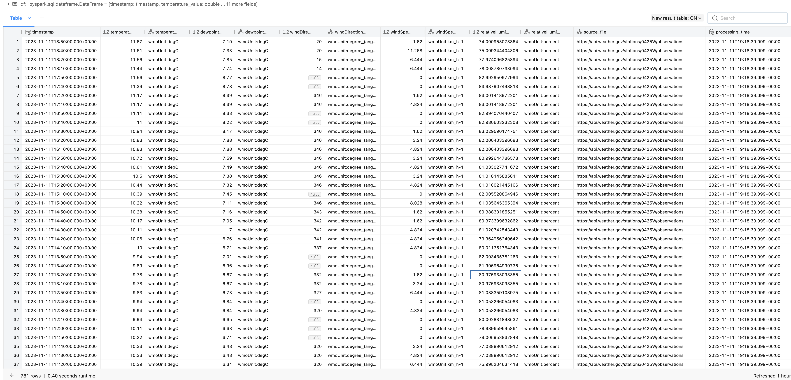

# Data Pipeline with Databricks

## Introduction
This is a simple data pipeline that uses Databricks to process data from a source National Weather Service, transform it, and load it into a destination. The pipeline is written in Python and uses the Databricks Delta Lake format for the destination.

## Architecture
The pipeline is designed to run on Databricks. It uses the following components:
* Databricks Runtime 7.3 LTS
* Databricks Delta Lake

## Data
The data used in this pipeline is from the National Weather Service (https://www.weather.gov/). It calls the API to get a list of observations for a given station (station ID: `0425W`, station Name: `NC State`) in JSON format. The data is then transformed and stored in a Databricks Delta Lake table.

## Pipeline
The pipeline is written in Python and uses the following libraries:
* `requests` to call the API
* `pyspark.sql` to transform the data, and write the data to a Delta Lake table

## Instructions
1. Create a Databricks cluster with the following configuration:
    * Databricks Runtime Version: `13.3 LTS (includes Apache Spark 3.4.1, Scala 2.12)`
    * Python Version: `Python 3`
    * Enable Autoscaling: `True`
    * Terminate after: `20 minutes`
    * Worker Type: `Standard_DS3_v2`
    * Minimum Workers: `1`
    * Maximum Workers: `8`
    * Auto Termination: `True`
    * Auto Termination Minutes: `20`

2. Create a Databricks notebook and paste the code from `etl_databrick_weather.py` into it.

3. Run the notebook.

4. Verify that the data is loaded into the Delta Lake table.

## Workflow
1. The notebook calls the API to get a list of observations for a given station (station ID: `0425W`, station Name: `NC State`) in JSON format.
```python
# Databricks notebook source
import requests
from pyspark.sql.functions import col, current_timestamp, from_json, get_json_object, lit
from pyspark.sql.types import *

# Define variables used in code below
username = spark.sql("SELECT regexp_replace(current_user(), '[^a-zA-Z0-9]', '_')").first()[0]
table_name = f"{username}_etl_weather"
checkpoint_path = f"/tmp/{username}/_checkpoint/etl_weather"
url = f'https://api.weather.gov/stations/0425W/observations'

# Pull weather data via api call
response = requests.get(url)
data = response.json()
```

2. The notebook select the needed fields (timestamp, temperature, dew point, wind direction, wind speed, relative humility) from dataframe and transforms the data.
```python
# Clear out data
spark.sql(f"DROP TABLE IF EXISTS {table_name}")
dbutils.fs.rm(checkpoint_path, True)

# Define dataframe schema
schema = StructType([
    StructField("id", StringType(), True),
    StructField("type", StringType(), True),
    StructField("geometry", StringType(), True),
    StructField("properties", StructType([
        StructField("@id",StringType(), True),
        StructField("@type", StringType(), True),
        StructField("elevation", StringType(), True),
        StructField("station", StringType(), True),
        StructField("timestamp", StringType(), True),
        StructField("rawMessage", StringType(), True),
        StructField("textDescription", StringType(), True),
        StructField("icon", StringType(), True),
        StructField("presentWeather", StringType(), True),
        StructField("temperature", StructType([
            StructField("value", StringType(), True),
            StructField("unitCode", StringType(), True),
            StructField("qualityControl", StringType(), True)
        ]), True),
        StructField("dewpoint", StructType([
            StructField("value", StringType(), True),
            StructField("unitCode", StringType(), True),
            StructField("qualityControl", StringType(), True)
        ]), True),
        StructField("windDirection", StructType([
            StructField("value", StringType(), True),
            StructField("unitCode", StringType(), True),
            StructField("qualityControl", StringType(), True)
        ]), True),
        StructField("windSpeed", StructType([
            StructField("value", StringType(), True),
            StructField("unitCode", StringType(), True),
            StructField("qualityControl", StringType(), True)
        ]), True),
        StructField("windGust", StringType(), True),
        StructField("seaLevelPressure", StringType(), True),
        StructField("visibility", StringType(), True),
        StructField("maxTemperatureLast24Hours", StringType(), True),
        StructField("minTemperatureLast24Hours", StringType(), True),
        StructField("precipitationLast3Hours", StringType(), True),
        StructField("relativeHumidity", StructType([
            StructField("value", StringType(), True),
            StructField("unitCode", StringType(), True),
            StructField("qualityControl", StringType(), True)
        ]), True),
        StructField("windChill", StringType(), True),
        StructField("heatIndex", StringType(), True),
        StructField("cloudLayers", StringType(), True)
    ]), True)
])

# Convert JSON response to PySpark DataFrame with schema
weather_df = spark.createDataFrame(data['features'], schema=schema)

# Add "source_file" column to DataFrame using lit() function
weather_df = weather_df.withColumn("source_file", lit(url))

# Select and transform fields
weather_df = (
    weather_df
    .select(
        col('properties.timestamp').cast("timestamp").alias('timestamp'),
        col('properties.temperature.value').cast("double").alias('temperature_value'),
        col('properties.temperature.unitCode').alias('temperature_unitCode'),
        col('properties.dewpoint.value').cast("double").alias('dewpoint_value'),
        col('properties.dewpoint.unitCode').alias('dewpoint_unitCode'),
        col('properties.windDirection.value').cast("double").alias('windDirection_value'),
        col('properties.windDirection.unitCode').alias('windDirection_unitCode'),
        col('properties.windSpeed.value').cast("double").alias('windSpeed_value'),
        col('properties.windSpeed.unitCode').alias('windSpeed_unitCode'),
        col('properties.relativeHumidity.value').cast("double").alias('relativeHumidity_value'),
        col('properties.relativeHumidity.unitCode').alias('relativeHumidity_unitCode'),
        col('source_file'),
        current_timestamp().alias('processing_time')
    )
)
```

3. The notebook writes the data to a Delta Lake table.
```python
# Write the DataFrame as a Delta table
weather_df.write.format("delta").mode("append").save(f"{checkpoint_path}/{table_name}")

# Read the Delta lake table into a DataFrame
df = spark.read.format("delta").load(f"{checkpoint_path}/{table_name}")

# Display the DataFrame as an interactive table
display(df)
```

## Results
The data is loaded into the Delta Lake table.
